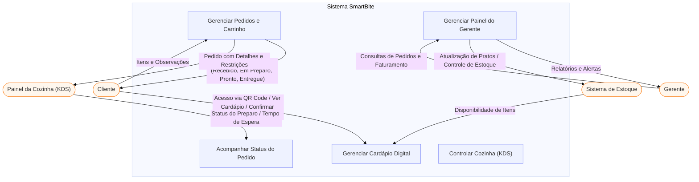
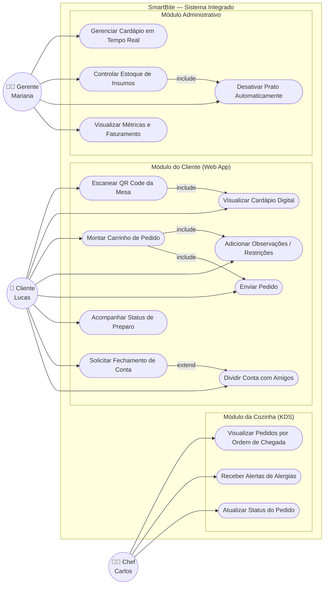
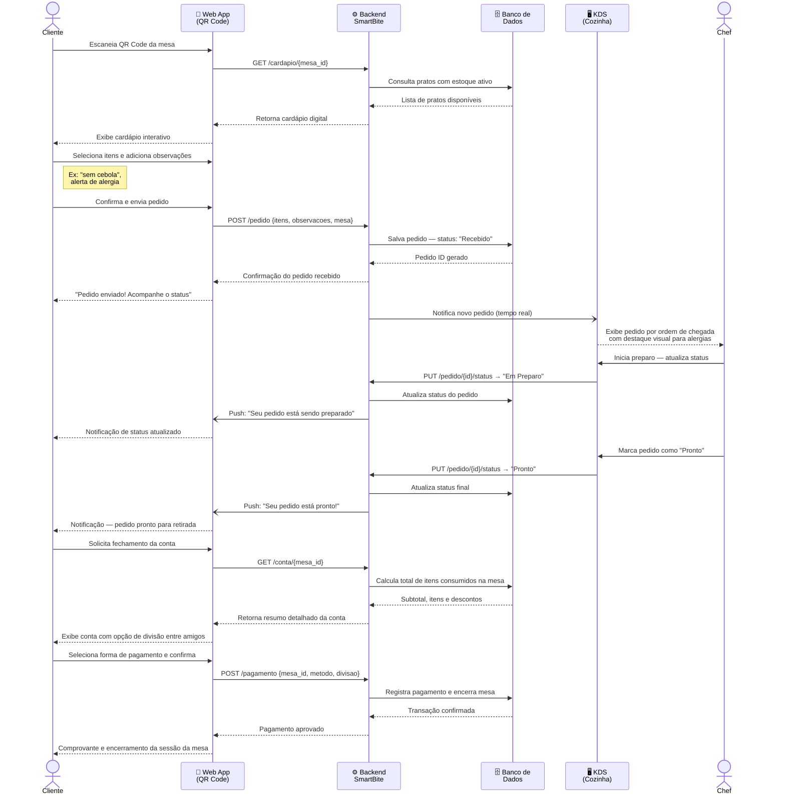
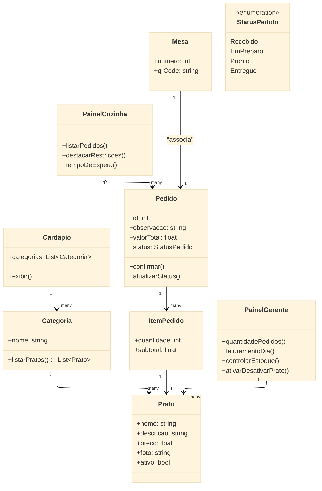

# Diagramas UML — SmartBite

## Diagrama de contexto

## Diagrama de Caso de Uso

---

## Diagrama de Sequência — Fluxo Principal (Caminho Feliz do MVP)

> Representa o fluxo validado na Sprint 1: cliente realiza pedido pela mesa e cozinha recebe no KDS.

## Diagrama de caso de uso

