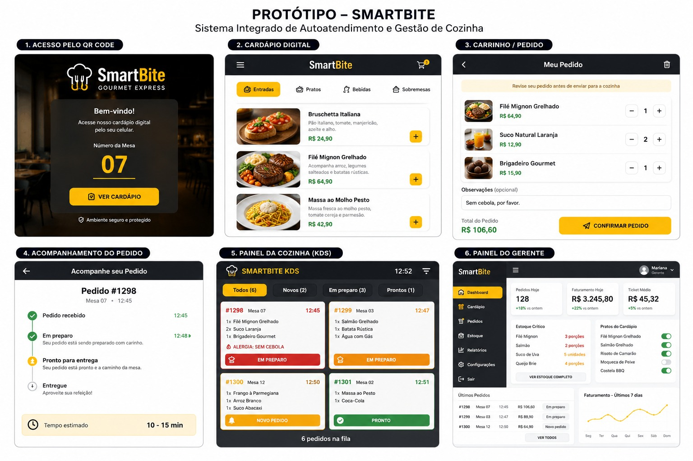

# ProjetoFinal-EngenhariaSoftware
# SmartBite — Sistema Integrado de Autoatendimento e Gestão de Cozinha

> Projeto Final — Disciplina de Engenharia de Software | Desenvolvimento Ágil com Scrum

  

Uma plataforma híbrida que automatiza a jornada do pedido desde a mesa até a produção: o cliente escaneia o QR Code, monta o pedido pelo celular e a cozinha recebe tudo organizado em tempo real, sem papel e sem ruído.

---

## Time

| Papel | Membro |
|---|---|
| Product Owner | Larissa S. Pereira |
| Developer / Modelagem | Erika Toledo |
| Developer / Modelagem | Talita Braz |
| Developer / Modelagem | Karen Evelyn |

---

## Navegação dos Documentos

### Definição e Planejamento

| Documento | Conteúdo |
|---|---|
| [Etapa 1 — Visão do Produto](etapa1-visao-produto.md) | Papéis do time, definição do problema, solução proposta, personas (Lucas, Chef Carlos, Mariana) e backlog inicial com priorização MoSCoW |

### Execução

| Documento | Conteúdo |
|---|---|
| [Sprint Review — Sprint 1](SprintReview.md) | Meta da sprint, itens aceitos (US01–US03), itens rejeitados (US04), feedbacks dos stakeholders e adaptações para a Sprint 2 |

### Modelagem Técnica

| Documento | Conteúdo |
|---|---|
| [Diagramas UML](diagramas.md) | Diagrama de contexto, diagrama de caso de uso, diagrama de classes e diagrama de sequência do fluxo principal (caminho feliz do MVP) |

---

## Visão Geral do Sistema

O SmartBite é composto por três módulos integrados:

**Módulo do Cliente (Web App via QR Code)**
O cliente escaneia o código na mesa, visualiza o cardápio digital, monta o pedido com observações e acompanha o status de preparo em tempo real. O fechamento e divisão da conta também são feitos pelo celular.

**Módulo da Cozinha — KDS (Kitchen Display System)**
Tela digital que substitui os papéis na cozinha. Pedidos chegam organizados por ordem de chegada, com alertas visuais de tempo de espera e destaque automático para restrições e alergias.

**Módulo Administrativo**
Painel do gerente para atualizar o cardápio em tempo real, controlar o estoque de insumos e visualizar métricas de faturamento. Quando um ingrediente zera no estoque, o prato é desativado automaticamente no cardápio do cliente.

---

## Status do Projeto

| Sprint | Meta | Status |
|---|---|---|
| Sprint 1 | Caminho feliz do MVP: QR Code → Pedido → KDS | Parcialmente concluída |
| Sprint 2 | Fechamento de conta, divisão e módulo de estoque | Em planejamento |

**Entregas da Sprint 1 validadas:**
- [US01] Acesso via QR Code e visualização do cardápio
- [US02] Realização de pedido com observações
- [US03] Painel da cozinha (KDS) com alertas visuais

**Pendente (retornou ao backlog):**
- [US04] Desativação automática de prato por falta de insumo