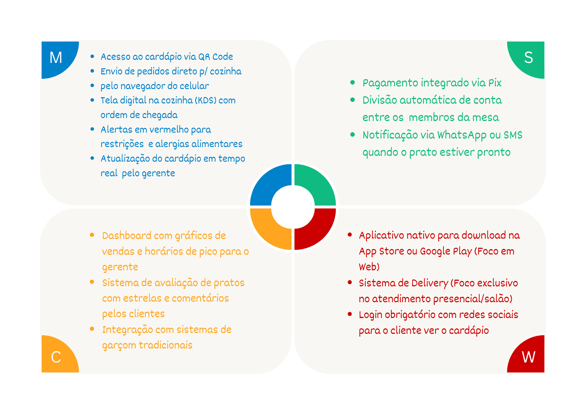
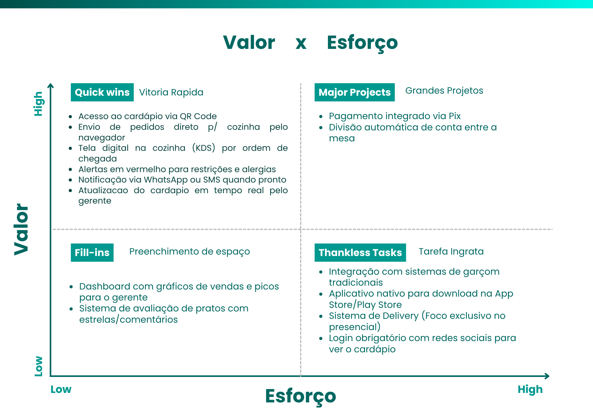
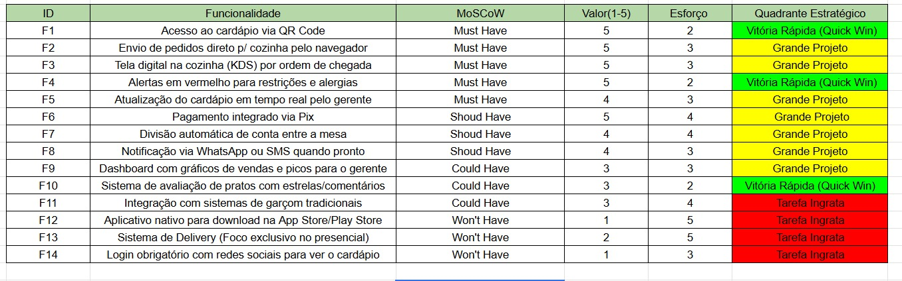

# Etapa 1 — Visão do Produto e Backlog Inicial

## Projeto Final: Desenvolvimento Ágil com Scrum – Etapa 1

### Time

| Papel | Membro |
|---|---|
| Product Owner (PO) | Larissa S. Pereira |
| Developer / Modelagem | Erika Toledo |
| Developer / Modelagem | Talita Braz |
| Developer / Modelagem | Karen Evelyn |

> O papel de Scrum Master foi dispensado para esta atividade pedagógica. O time foi estruturado com foco na liderança do produto e na especificação técnica.

---

### Atividade 1: Definição dos Papéis

- **Product Owner (PO):** Larissa S. Pereira
  - Responsável por definir a visão do produto, negociar os requisitos com as partes interessadas e priorizar o Backlog do Produto para garantir o maior valor de entrega.

- **Time Scrum (Developers / Especialistas em Modelagem):** Erika Toledo, Talita Braz e Karen Evelyn.
  - Responsáveis pela análise, modelagem de dados, design de interface (UI/UX) e especificação técnica do sistema, transformando a visão do PO em requisitos acionáveis.

---

### Atividade 2: Escolha do Problema

#### Cliente Fictício

**Rede de Restaurantes "Gourmet Express"**

#### O Problema

Restaurantes físicos enfrentam um grande gargalo no atendimento durante os horários de pico (almoço e fins de semana), gerando frustração tanto para os clientes quanto para a equipe:

1. **Demora e erros nos pedidos:** Garçons sobrecarregados demoram para atender, anotam pedidos errados e esquecem de avisar a cozinha sobre restrições alimentares.

2. **Gargalo na Cozinha:** A cozinha recebe os pedidos em papel ou de forma desorganizada, gerando atrasos e pratos saindo frios.

3. **Desperdício de Alimentos e Furo de Estoque:** Pratos continuam disponíveis no cardápio mesmo quando um ingrediente essencial acabou na cozinha, gerando o famoso "desculpe, esse prato acabou", que frustra o cliente após minutos de espera.

#### A Solução — SmartBite

**SmartBite: Sistema Integrado de Autoatendimento e Gestão de Cozinha**

Uma plataforma híbrida (focada em Web App para o cliente e Dashboard para o restaurante) que automatiza a jornada do pedido desde a mesa até a produção, sem a necessidade de baixar um app pesado.

- **Módulo do Cliente**
  - O cliente senta à mesa, escaneia o QR Code e acessa o cardápio digital interativo.
  - Faz o pedido, adiciona observações (ex: "sem cebola"), acompanha o status de preparo em tempo real e pode fechar/pagar a conta direto pelo celular (dividindo o valor com os amigos de forma automatizada).

- **Módulo da Cozinha (KDS — Kitchen Display System)**
  - Uma tela digital substitui os papéis na cozinha. Os pedidos entram organizados por ordem de chegada, com alertas visuais de tempo de espera e destaque automático para restrições/alergias alimentares.

- **Módulo Administrativo e Estoque Inteligente**
  - Painel do gerente que atualiza o cardápio em tempo real. Se o estoque de "filé mignon" zerar no sistema, o prato é desativado automaticamente no QR Code dos clientes, evitando vendas frustradas.

---

### Atividade 3: Visão do Produto e Personas

Para alinhar o design de interface (UI/UX) e o fluxo do sistema, mapeamos as três personas principais que interagem com o ecossistema do SmartBite:

#### Persona 1: O Cliente da Mesa

- **Nome:** Lucas, 23 anos.
- **Perfil:** Estudante universitário, focado em praticidade, costuma almoçar com pressa entre as aulas ou sair com amigos no fim de semana.
- **Necessidade:** Quer sentar, escolher o prato rapidamente, não quer mofar esperando o garçom trazer o cardápio ou a maquininha de cartão, e odeia a confusão de calcular e dividir a conta no final.

#### Persona 2: O Chef de Cozinha

- **Nome:** Chef Carlos, 42 anos.
- **Perfil:** Profissional experiente, detalhista, trabalha sob alta pressão e ritmo acelerado.
- **Necessidade:** Precisa receber os pedidos de forma ultraorganizada, clara (sem garranchos de garçom) e com destaque absoluto para restrições e alergias alimentares para evitar erros fatais na cozinha.

#### Persona 3: O Gerente do Restaurante

- **Nome:** Mariana, 35 anos.
- **Perfil:** Focada em métricas de eficiência, controle de custos e satisfação do cliente.
- **Necessidade:** Precisa acompanhar o tempo médio de preparo dos pratos, faturamento do dia e ter autonomia para pausar a venda de um prato instantaneamente se um ingrediente do estoque acabar.

---

### Atividades 4 e 5: Product Backlog Inicial e Priorização

A triagem foi feita utilizando a técnica **MoSCoW** para definir o valor de negócio e o que é vital para o MVP (Mínimo Produto Viável).

#### Matriz MoSCoW

#### Valor vs. Esforço

#### Planilha de Priorização Híbrido (MoSCoW + Valor vs. Esforço)

